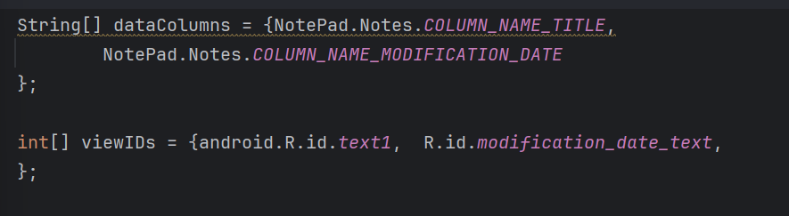

#  Android期中实验
## NotePad记事本应用

   本次项目实现了Note_pad的一些基本功能，共有四个功能

   下面将对这四个功能进行效果展示和关键源码的截图展示。

## 一、必需功能

### 1.时间戳功能


效果展示：


图1.笔记列表中每条笔记显示其最后修改的时间戳。
时间戳随笔记的修改动态更新。

关键实现步骤：
在数据库中为笔记添加时间戳字段。
在笔记列表项布局中添加显示时间戳的文本框。
在适配器中绑定时间戳数据，并格式化显示。

数据库列的声明:

图2.private static final String[] PROJECTION = new String[]{...};：定义了一个字符串数组 PROJECTION，它指定了从数据库查询笔记时需要的列。这里包括了笔记的 ID、标题和修改日期。

设置 SimpleCursorAdapter 的一部分，它定义了如何从数据库中检索数据以及如何在应用的用户界面上显示这些数据。

图3.确保你的数据库列名、布局文件中的视图 ID 和 SimpleCursorAdapter 的设置之间保持一致性。

通过 SimpleCursorAdapter 来将数据库查询结果绑定到一个列表视图中，同时自定义了如何将时间戳（代表最后修改时间）格式化成可读的日期时间字符串，并显示在指定的 TextView 中。


定义一个TextView，用于显示笔记的修改日期。这个TextView被赋予了一个ID @+id/modification_date_text，可以在Java代码中通过这个ID引用它。

图5.属性说明
android:id="@+id/modification_date_text": 为TextView指定了一个唯一标识符，以便在Java代码中引用。
android:layout_width="match_parent": 设置视图的宽度与父容器相匹配。
android:layout_height="wrap_content": 视图的高度将根据其内容自动调整。
android:textColor="#FFFFFF": 设置文本颜色为白色。
android:textSize="14sp": 设置文本大小为14sp（scale-independent pixels）。
android:gravity="start": 将文本内容对齐到视图的左侧。
android:paddingTop="4dp" 和 android:paddingLeft="16dp": 设置顶部和左侧的内边距。
android:lineSpacingExtra="2dp": 在文本行之间增加额外的垂直间距。


### 2.搜索功能
为笔记添加搜索功能且能以笔记标题或者内容作为关键词进行模糊查询


图6.在笔记列表界面添加搜索框。


图7.用户可以通过笔记的标题或内容进行搜索

根据标题进行模糊搜索：


图8.更新界面以显示搜索结果。

根据内容进行模糊搜索：


图9、10.更新界面以显示搜索结果。

   具体实现：


private void searchNotes(String query)

这个方法是 `private` 类型的，意味着它只能在当前类中访问。它接受一个 `String` 类型的参数 `query`，表示用户输入的搜索词。

String searchQuery = "%" + query + "%";

为了在 SQL 查询中进行模糊匹配，代码将 `query` 包裹在两个百分号 `%` 之间，表示查询字符串中包含这个 `query` 字符串的记录。`%` 是 SQL 中的通配符，表示任意字符。

Cursor cursor = getContentResolver().query(
        getIntent().getData(),  // URI
        PROJECTION,  // Columns to return
        NotePad.Notes.COLUMN_NAME_TITLE + " LIKE ? OR " + NotePad.Notes.COLUMN_NAME_NOTE + " LIKE ?",  // WHERE clause
        new String[]{searchQuery, searchQuery},  // Bind the search query to the parameters
        NotePad.Notes.DEFAULT_SORT_ORDER  // Sort order
);

getContentResolver().query()：执行查询操作，`ContentResolver` 是 Android 提供的一种机制，用于访问不同内容提供者的数据。通过 `query()` 方法，可以从某个 URI 获取数据。

(`getIntent().getData()`)：通过 `getIntent().getData()` 获取查询的 URI，这通常是某个数据库或内容提供者的 URI。

PROJECTION：表示查询时需要返回的列。它通常是一个字符串数组，包含需要查询的列名（这里没有明确给出，假设是常量 `PROJECTION`）。

WHERE 子句：通过 `NotePad.Notes.COLUMN_NAME_TITLE + " LIKE ? OR " + NotePad.Notes.COLUMN_NAME_NOTE + " LIKE ?"`，代码构建了一个 SQL 查询条件，表示同时在笔记标题和内容中搜索。两个 `?` 将绑定到查询条件中。

绑定查询参数：`new String[]{searchQuery, searchQuery}` 将搜索关键字 `searchQuery` 绑定到查询中的两个 `?` 占位符上。

排序顺序：`NotePad.Notes.DEFAULT_SORT_ORDER`，定义了查询结果的排序规则，假设是按修改日期排序。

String[] dataColumns = {
        NotePad.Notes.COLUMN_NAME_TITLE,
        NotePad.Notes.COLUMN_NAME_MODIFICATION_DATE
};

这部分定义了一个 `dataColumns` 数组，表示将从查询结果中提取的列。这些列是 `NotePad.Notes.COLUMN_NAME_TITLE`（标题）和 `NotePad.Notes.COLUMN_NAME_MODIFICATION_DATE`（修改日期）。

int[] viewIDs = {android.R.id.text1, R.id.modification_date_text};
````viewIDs` 数组包含了与查询结果绑定的 UI 组件的 ID，`android.R.id.text1` 是默认的文本控件 ID，`R.id.modification_date_text` 是布局文件中定义的用于显示修改日期的文本控件。

使用了 Android 的 `ContentResolver` 来执行查询，`SimpleCursorAdapter` 来将查询结果绑定到 UI 上，并且通过 `ViewBinder` 自定义格式化日期。

   关键代码截图如下：


##    二 附加功能

###    1.UI美化


android:id：@android:id/text1 是一个系统预定义的 ID，用于标识该视图。通常这个 ID 用于 ListView 或 RecyclerView 中的项视图（如 android.R.id.text1）。

layout_width 和 layout_height：

layout_width="match_parent"：宽度填充父容器。
layout_height="wrap_content"：高度根据内容的高度来调整。
textAppearance：android:textAppearance="?android:attr/textAppearanceLarge" 使用系统定义的 textAppearanceLarge 样式，这会设置一个较大的文本样式。

textColor：android:textColor="#FFFFFF" 设置文本颜色为白色。

gravity：android:gravity="center_vertical" 将文本垂直居中对齐。

paddingLeft 和 paddingRight：android:paddingLeft="16dp" 和 android:paddingRight="16dp" 为文本视图左右添加 16dp 的内边距。

singleLine：android:singleLine="true" 设置文本为单行显示。

textStyle：android:textStyle="bold" 设置文本加粗。

textSize：android:textSize="18sp" 设置文本字体大小为 18sp。

ellipsize：android:ellipsize="end" 设置文本超出显示范围时以省略号 ... 结尾。

lineSpacingExtra：android:lineSpacingExtra="4dp" 设置文本行之间的额外间距（尽管 singleLine="true" 已设置为单行显示，这个属性对当前视图不起作用）。


class：class="com.example.android.notepad.NoteEditor$LinedEditText" 指定该视图为 NoteEditor 类中的一个自定义子类 LinedEditText。这意味着该控件是自定义控件，通常会实现一些特定的功能，例如在文本框中显示行号。

android:id：@+id/note 为该视图指定了一个唯一的 ID，便于在代码中引用。

layout_width 和 layout_height：match_parent 表示该控件的宽度和高度都将填充其父容器，确保它在布局中占据完整空间。

padding：android:padding="20dp" 设置控件内的内边距，使得内容与控件的边缘保持一定距离。

scrollbars：android:scrollbars="vertical" 设置该控件的滚动条为垂直方向。如果文本内容超过控件显示区域，就会显示垂直滚动条。

fadingEdge：android:fadingEdge="vertical" 启用垂直方向的渐变效果。当文本框滚动时，控件的顶部或底部会逐渐变得透明，增强用户体验。

gravity：android:gravity="top|start" 设置文本的对齐方式为顶部对齐且从左侧开始显示。

textSize：android:textSize="18sp" 设置文本的字体大小为 18sp（以屏幕密度独立像素为单位）。

textColor：android:textColor="#333333" 设置文本的颜色为深灰色。

hint：android:hint="请输入笔记..." 为文本框提供了一个提示文本，显示在文本框为空时。

textColorHint：android:textColorHint="#BBBBBB" 设置提示文本的颜色为灰色。

lineSpacingExtra：android:lineSpacingExtra="6dp" 设置行间距为 6dp，使得每行之间有一定的垂直间距。

inputType：android:inputType="textMultiLine|textCapSentences" 设置输入类型为多行文本，并且首字母大写。

fontFamily：android:fontFamily="sans-serif-medium" 设置字体为 sans-serif-medium，即无衬线体的中等粗细。

maxLines：android:maxLines="20" 设置最大显示行数为 20 行。如果内容超过 20 行，则会启用滚动条。

scrollHorizontally：android:scrollHorizontally="false" 禁用水平滚动，表示文本框内的内容不会水平滚动。

layout_margin：android:layout_margin="16dp" 设置控件的外边距为 16dp，使其与父布局的其他元素保持一定距离。

elevation：android:elevation="6dp" 设置控件的阴影高度，使其在界面上稍微浮起，形成立体效果。

overScrollMode：android:overScrollMode="always" 设置控件在滚动到边缘时总是显示超出部分的反弹效果。

layout_gravity：android:layout_gravity="center" 将控件放置在父布局的中心。

添加图标和背景图：

        android:icon="@drawable/ic_search"
        android:background="@drawable/note_background"

效果图如下：


###    2.导出笔记功能

   为Note_pad添加了导出笔记功能，长按导出到手机的文件中，文件内容包括笔记标题，笔记内容和笔记编辑时间。
   以下为其效果图：


导出笔记的功能，逻辑清晰地分为几个步骤：首先检查是否选择了笔记，如果选择了笔记，则从数据库中查询该笔记的标题和修改日期，并获取笔记的内容，最后将笔记导出为一个 `.txt` 文件。

private void exportNote() {
    // 获取当前选中的笔记 ID
    if (selectedNoteId == -1) {
        Toast.makeText(this, "未选择笔记", Toast.LENGTH_SHORT).show();
        return;
    }

功能：这部分代码首先检查 `selectedNoteId` 的值。如果该值为 `-1`，表示没有选择任何笔记，程序会弹出一个提示框（`Toast`），提醒用户没有选择笔记，并返回，退出方法，后续的导出操作不会执行。

为什么这样做：`selectedNoteId` 是用来标识当前选中笔记的 ID，如果没有选中笔记，直接退出是为了防止后续操作出现错误。

    // 继续执行导出逻辑...
    Cursor cursor = getContentResolver().query(
            ContentUris.withAppendedId(NotePad.Notes.CONTENT_URI, selectedNoteId),
            new String[]{NotePad.Notes.COLUMN_NAME_TITLE, NotePad.Notes.COLUMN_NAME_MODIFICATION_DATE},
            null, null, null
    );

功能：这段代码通过 `getContentResolver().query()` 方法从笔记数据库中查询当前选中笔记的标题（`COLUMN_NAME_TITLE`）和修改日期（`COLUMN_NAME_MODIFICATION_DATE`）。`selectedNoteId` 被用于确定查询的笔记。
  
关键函数：
   `getContentResolver()`：获取 `ContentResolver`，用来访问和操作应用的内容提供者（`ContentProvider`），这里是访问存储笔记数据的内容提供者。
   `ContentUris.withAppendedId()`：将 `NotePad.Notes.CONTENT_URI` 和 `selectedNoteId` 组合成一个有效的 URI，确保查询的是当前选中的笔记。
   `query()`：执行查询操作，返回一个 `Cursor`，包含选中笔记的相关数据（标题和修改日期）。

    if (cursor != null && cursor.moveToFirst()) {
        String title = cursor.getString(cursor.getColumnIndex(NotePad.Notes.COLUMN_NAME_TITLE));
        String modificationDate = cursor.getString(cursor.getColumnIndex(NotePad.Notes.COLUMN_NAME_MODIFICATION_DATE));
        String content = getNoteContent(selectedNoteId);


   `cursor != null && cursor.moveToFirst()`：首先检查查询结果是否为空，如果不为空，则移动游标到查询结果的第一行。这通常意味着查询成功并且有数据返回。
  从 `cursor` 中获取笔记的 标题 和 修改日期，通过 `getColumnIndex()` 获取相应列的索引，再用 `getString()` 获取数据。
  `getNoteContent(selectedNoteId)` 是调用自定义的函数来获取当前笔记的 内容**。

   `cursor.getColumnIndex()`：返回指定列的索引值。
   `cursor.getString()`：通过索引从游标中提取该列的值。


        if (content != null && !content.isEmpty()) {
            // 格式化修改日期
            String formattedDate = formatModificationDate(Long.parseLong(modificationDate));
            exportToTXT(title, content, formattedDate);
        } else {
            Toast.makeText(this, "笔记内容为空", Toast.LENGTH_SHORT).show();
        }

  先检查笔记的内容是否为空。如果内容不为空，则：
   调用 `formatModificationDate()` 方法将修改日期格式化成所需的字符串形式（可能是将时间戳转换为日期格式）。

    调用 `exportToTXT()` 方法，将标题、内容和格式化后的修改日期导出为 `.txt` 文件。
  如果笔记内容为空，则弹出提示框（`Toast`），告知用户笔记内容为空。

  `formatModificationDate(Long.parseLong(modificationDate))`：
  `modificationDate` 是字符串类型的时间戳，将其转换为 `long` 类型后，调用 `formatModificationDate()` 方法进行日期格式化。
  `exportToTXT()` 是一个自定义方法，用来将笔记导出为 `.txt` 文件。

```java
        cursor.close();
    }
```

- **功能**：当操作完成后，关闭游标 `cursor`，以释放数据库资源。游标是数据库查询操作的结果，需要在使用完后显式关闭，防止资源泄露。

主要代码如下：


